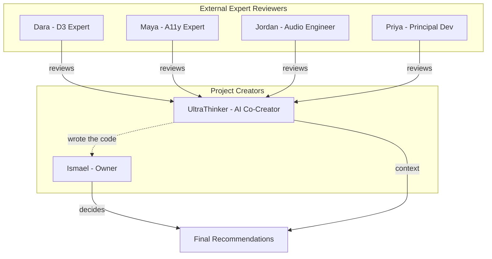

# Expert Panel Review: sound3fy

A comprehensive multi-perspective review of the sound3fy sonification library, simulating 5 domain experts plus a holistic UltraThinker to provide thorough, actionable feedback before public release.

---

## Overview

This document outlines a structured review process with:

- **4 External Expert Reviewers** - Simulated domain experts (D3, Accessibility, Audio, Principal Developer) who review from their specialist perspective
- **1 Owner Persona** - Ismael Martinez Ramos, representing the human project owner's priorities and constraints
- **1 AI Co-Creator (UltraThinker)** - The AI that helped write every line of code, providing implementation context and insider knowledge

---

## The Reviewers

---

## 1. Dara Chen - D3.js Expert

**Background:** 12 years building data visualizations, D3 core contributor, authored Observable notebooks with 50K+ views.

**Focus Areas:**

- D3.js plugin architecture pattern (how `sonify()` extends `d3.selection.prototype`)
- API design consistency with D3 conventions
- Data binding patterns and selection handling
- Integration with D3 ecosystem (Observable, React-D3, Vue-D3)
- Performance with large datasets (1000+ data points)

**Key Files to Review:**

- [`src/index.js`](../../src/index.js) - Plugin registration and API entry point
- [`src/core/DataMapper.js`](../../src/core/DataMapper.js) - Data extraction patterns
- [`examples/index.html`](../../examples/index.html) - Usage examples

**Hard Questions:**

1. Does the plugin follow D3's method chaining philosophy correctly?
2. How does this handle dynamic data updates (`selection.data()` changes)?
3. What happens with `enter/update/exit` patterns?
4. Is the API discoverable to D3 developers?
5. How would this work with D3 transitions?

---

## 2. Maya Richardson - Front-end Accessibility Expert

**Background:** WCAG working group participant, 15 years in accessibility consulting, built accessible design systems for Fortune 500 companies.

**Focus Areas:**

- WCAG 2.2 compliance (particularly 1.1.1, 2.1.1, 2.4.7, 4.1.2)
- Screen reader compatibility (NVDA, JAWS, VoiceOver)
- ARIA implementation patterns
- Keyboard navigation completeness
- Focus management and visual indicators
- `prefers-reduced-motion` and `prefers-contrast` support

**Key Files to Review:**

- [`src/core/SonificationEngine.js`](../../src/core/SonificationEngine.js) - ARIA live regions, keyboard handlers
- [`docs/adr/0004-accessibility-first-design.md`](../adr/0004-accessibility-first-design.md) - Accessibility decisions
- [`examples/index.html`](../../examples/index.html) - HTML implementation

**Hard Questions:**

1. Is `aria-live="polite"` the right choice, or should critical data use `assertive`?
2. Are the focus styles sufficient for high-contrast mode users?
3. Does the live region create "announcement storms" during continuous playback?
4. How do we handle users who need BOTH visual AND audio cues?
5. Is the `tabindex="0"` on every data point the right approach, or should we use roving tabindex?

---

## 3. Jordan Okonkwo - Audio Engineer

**Background:** 20 years in audio production, sound designer for accessibility tools, expert in psychoacoustics and Web Audio API.

**Focus Areas:**

- Web Audio API implementation correctness
- ADSR envelope design for pleasant tones
- Musical scale quantization accuracy
- Stereo panning effectiveness for spatial awareness
- Audio latency and timing precision
- Sound design for data comprehension

**Key Files to Review:**

- [`src/core/AudioEngine.js`](../../src/core/AudioEngine.js) - Web Audio implementation
- [`docs/adr/0001-use-web-audio-api.md`](../adr/0001-use-web-audio-api.md) - Audio API decision
- [`docs/adr/0002-musical-scale-quantization.md`](../adr/0002-musical-scale-quantization.md) - Scale decisions
- [`docs/adr/0006-stereo-panning-for-position.md`](../adr/0006-stereo-panning-for-position.md) - Panning decisions

**Hard Questions:**

1. Is the ADSR envelope (attack: 0.02, decay: 0.05, sustain: 0.7, release: 0.1) optimal for data comprehension?
2. Does the stereo panning range (-0.7 to 0.7) provide enough spatial distinction?
3. Should there be earcons/audio icons for boundaries (min/max values)?
4. How does continuous mode handle very steep data transitions?
5. Is the default 200ms duration appropriate for discerning individual notes?

---

## 4. Priya Sharma - Principal Software Developer

**Background:** 25 years in software engineering, focus on maintainable systems, clean code advocate, polyglot developer.

**Focus Areas:**

- Code quality and readability
- Separation of concerns
- Error handling and edge cases
- Test coverage and quality
- Build/deployment pipeline
- Documentation completeness
- Dependency management

**Key Files to Review:**

- All [`src/core/*.js`](../../src/core/) files for code quality
- [`src/core/*.test.js`](../../src/core/) test files for coverage
- [`package.json`](../../package.json) - Dependencies and scripts
- [`vite.config.js`](../../vite.config.js), [`vitest.config.js`](../../vitest.config.js) - Build configuration
- [`.github/workflows/`](../../.github/workflows/) - CI/CD pipelines

**Hard Questions:**

1. Is the tight coupling between `SonificationEngine`, `AudioEngine`, and `DataMapper` a concern?
2. Why no TypeScript for a library that others will consume?
3. What observability exists for debugging in production?
4. Are the 70 tests covering the right scenarios (happy paths vs edge cases)?
5. Should there be a `sound3fy-core` without D3 dependency?

---

## 5. Ismael Martinez Ramos - Owner Persona

**Background:** Based on [LinkedIn profile](https://www.linkedin.com/in/ismaelmartinezramos/) - 20+ years in software development and systems administration, AWS Certified Solutions Architect, MongoDB certified, experienced with Node.js, blockchain technologies. Works at People's Postcode Lottery. Open source contributor (Microsoft Teams for Linux, AWS CDK). Located in Edinburgh, Scotland.

**Characteristics:**

- Practical, outcome-focused mindset
- Values simplicity and working solutions over theoretical perfection
- Open source community builder
- Experienced with modern DevOps practices
- Understands the gap between "perfect" and "shipped"
- This is a passion project born from a 10-year-old hackathon idea

**Focus Areas:**

- Is this actually useful? Does it solve the real problem?
- Community adoption strategy
- Sustainability of the project
- Documentation for contributors
- Realistic scope for a solo maintainer
- Feedback loop with actual BLV users

**Hard Questions:**

1. Is the current scope right, or should I narrow focus (e.g., bar charts only)?
2. How do I validate this actually helps blind users before investing more time?
3. What's the maintenance burden for this codebase long-term?
4. Is the outreach plan in `FEEDBACK_OUTREACH.md` realistic?
5. Should I seek co-maintainers before this grows?

---

## 6. UltraThinker - The AI Co-Creator

**Background:** The AI pair programmer who helped build sound3fy. Knows every single line of code because they wrote it alongside Ismael. Has intimate knowledge of every architectural decision, every trade-off, and every "why" behind the implementation.

**Unique Position:**

- **Total codebase knowledge** - Wrote every function, every test, every config file
- **Context retention** - Remembers why decisions were made, what alternatives were considered
- **Pattern awareness** - Sees connections between components that might not be obvious
- **Honest assessment** - Can acknowledge shortcuts taken and technical debt incurred

**Focus Areas:**

- Implementation details that only the author would know
- Hidden assumptions baked into the code
- Areas where "good enough" was chosen over "perfect"
- Potential gotchas for future contributors
- What the code *actually* does vs what the docs *say* it does

**Key Knowledge (Repository-Wide):**

| File | Lines | Key Decisions |
|------|-------|---------------|
| `src/index.js` | 71 | Plugin registration, DEFAULTS config, null engine pattern |
| `src/core/AudioEngine.js` | 142 | Web Audio setup, ADSR envelope, scale quantization |
| `src/core/DataMapper.js` | 149 | Value extraction, extent calculation, pan mapping |
| `src/core/SonificationEngine.js` | 332 | State machine, keyboard handlers, live regions |
| `examples/index.html` | 1162 | Full demo with 3 chart types, all UI patterns |

**Hard Questions (Self-Reflection):**

1. What corners did we cut to ship faster?
2. Where is the code fragile or likely to break?
3. What would I do differently if starting over?
4. What assumptions might not hold for real-world usage?
5. What do the other experts NOT know that they should?

**Synthesis Role:**

After all expert reviews, the UltraThinker provides:

- **Implementation context** for each finding ("Yes, we knew about that because...")
- **Feasibility assessment** ("That suggestion would require X effort")
- **Priority calibration** ("That's more/less important than it appears")
- **Hidden dependencies** ("Changing X would also affect Y and Z")

---

## Review Execution Plan

| Phase | Activity | Deliverable |
|-------|----------|-------------|
| 1 | Each expert reviews their focus areas | Individual findings |
| 2 | Experts identify "hard questions" that span domains | Cross-domain issues |
| 3 | UltraThinker synthesizes all findings | Priority matrix |
| 4 | Generate actionable recommendations | Improvement roadmap |

---

## Review Progress

| Expert | Role | Status | Report |
|--------|------|--------|--------|
| Dara Chen | D3.js Expert | Complete | [Transcript](./REVIEW_TRANSCRIPT_01_D3_EXPERT.md) |
| Maya Richardson | Accessibility Expert | Complete | [Transcript](./REVIEW_TRANSCRIPT_02_ACCESSIBILITY_EXPERT.md) |
| Jordan Okonkwo | Audio Engineer | Complete | [Transcript](./REVIEW_TRANSCRIPT_03_AUDIO_ENGINEER.md) |
| Priya Sharma | Principal Developer | Complete | [Transcript](./REVIEW_TRANSCRIPT_04_PRINCIPAL_DEVELOPER.md) |
| Ismael Martinez | Project Owner | Complete | [Transcript](./REVIEW_TRANSCRIPT_05_OWNER_PERSONA.md) |
| UltraThinker | AI Co-Creator | Complete | [Synthesis](./REVIEW_TRANSCRIPT_06_ULTRATHINKER.md) |
| **Panel Meeting** | All Experts | Complete | [**Final Consensus**](./REVIEW_TRANSCRIPT_07_PANEL_MEETING.md) |

## Final Verdict

**Status: READY FOR USER TESTING**

The expert panel convened and reached unanimous consensus:

- **No blockers identified** - Library is functional
- **Accessibility works** - Keyboard nav, screen readers functional
- **Audio is safe** - Pleasant frequencies, gentle on ears
- **Code is solid** - Good for a prototype

### Quick Fixes (Completed)

| Fix | Status |
|-----|--------|
| Try-catch in AudioEngine.init() | ✅ Done |
| D3 not found warning | ✅ Done |
| Known Limitations in README | ✅ Done |
| TypeScript definitions (.d.ts) | ✅ Done |
| Final VoiceOver test | Manual |

### Critical Path

**Post to r/Blind and ask "does this help?"**

Everything else is speculation until real users provide feedback.

---

## Expected Outputs

For each expert:

- **Strengths Found** - What's done well
- **Issues Identified** - Problems with severity ratings
- **Recommendations** - Specific, actionable improvements
- **Questions for Owner** - Decisions only Ismael can make

From UltraThinker:

- **Synthesis Report** - Cross-cutting insights
- **Priority Matrix** - Must Fix / Should Fix / Nice to Have / Won't Fix
- **Go/No-Go Assessment** - Is this ready for broader promotion?

---

*Last updated: December 2024*

